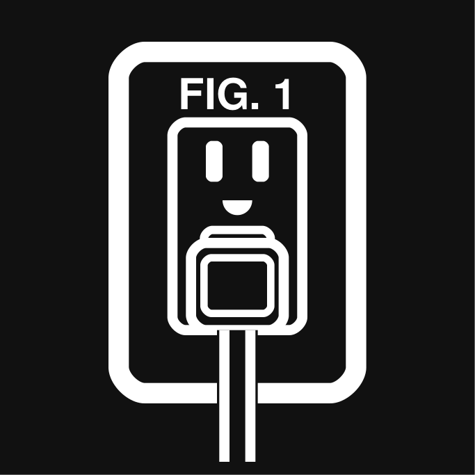
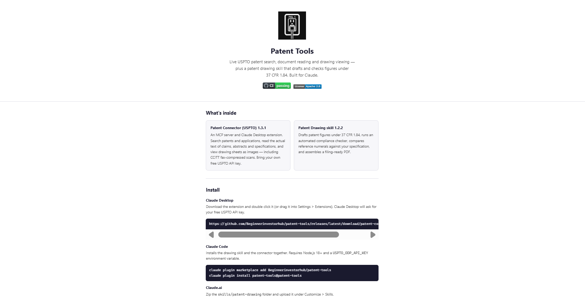

<p align="center">
  
</p>

# Patent Tools

[](https://github.com/Beginnerinvestorhub/patent-tools/actions/workflows/ci.yml)
[](LICENSE)
[](https://github.com/Beginnerinvestorhub/patent-tools/issues)

Two companion tools that give Claude patent superpowers: live access to the
USPTO Open Data Portal, and the ability to draft and check USPTO-compliant
patent drawings.

<a href="https://beginnerinvestorhub.github.io/patent-tools/"></a>

> These are research and drafting tools, not legal advice. Have a registered
> patent attorney or agent review anything before you rely on it or file.

## What's inside

Versions: Patent Connector (USPTO) 1.3.1, Patent Drawing skill 1.2.2,
plugin 1.3.1.

| Component | What it is |
|---|---|
| [`connector/`](connector/) | **Patent Connector (USPTO)** — an MCP server / Claude Desktop extension. Search USPTO patents and applications, look them up by application or patent number, read the actual text of claims, abstracts and specifications, and view the drawing sheets as images, using your own free USPTO API key. |
| [`skills/patent-drawing/`](skills/patent-drawing/) | **Patent Drawing skill** — drafts patent figures under 37 CFR 1.84, runs an automated compliance checker, compares reference numerals against your specification, and assembles a filing-ready PDF. |

## Install

Pick the channel you use:

* **Claude Desktop.** Download
  [patent-connector-1.3.1.mcpb](https://github.com/Beginnerinvestorhub/patent-tools/releases/latest/download/patent-connector-1.3.1.mcpb)
  from the latest release, then double click it (or drag it
  into **Settings > Extensions**). See
  [connector/README.md](connector/README.md) for setup and your API key.
* **Claude.ai.** Zip the `skills/patent-drawing` folder and upload it under
  **Customize > Skills**. See
  [skills/patent-drawing/README.md](skills/patent-drawing/README.md).
* **Claude Code.** Install the whole repo as a plugin — the
  `.claude-plugin/` manifest also wires up the Patent Connector MCP
  server (requires `node` and a `USPTO_ODP_API_KEY` environment
  variable):

  ```
  claude plugin marketplace add Beginnerinvestorhub/patent-tools
  claude plugin install patent-tools@patent-tools
  ```

  Or copy just `skills/patent-drawing/` into `~/.claude/skills/`
  (all projects) or `.claude/skills/` (one project). The plugin starts
  the committed single file
  bundle `connector/dist/patent-connector.mjs`, which already contains every
  dependency, so no `npm install` is needed. Set `USPTO_ODP_API_KEY` in the
  environment that starts Claude Code; the plugin has no settings screen
  for it. See [Set your USPTO API key](#set-your-uspto-api-key).
* **Devin CLI / Desktop / cloud.** `devin plugins install
  Beginnerinvestorhub/patent-tools`. Installs the skill and the connector
  MCP server together.

## Set your USPTO API key

The connector needs your own free key from
[data.uspto.gov](https://data.uspto.gov) (sign in, then **My ODP**).

* **Claude Desktop extension (`.mcpb`):** Claude Desktop asks for the key
  when you install it and keeps it in the extension's settings. Nothing
  else to do.
* **Plugin (Claude Code and other hosts using `.mcp.json` or
  `mcp_config.json`):** the plugin reads the `USPTO_ODP_API_KEY`
  environment variable. Set it once:
  * **Claude Code (easiest):** when the plugin is enabled, Claude Code
    prompts for the key and stores it in secure storage. You can also
    set it later via the plugin's configure options. The older paths
    still work: `"env": {"USPTO_ODP_API_KEY": "your_key_here"}` in
    `~/.claude/settings.json`, or the OS environment variable below.
  * **Windows:** run `setx USPTO_ODP_API_KEY "your_key_here"` in Command
    Prompt or PowerShell, or add it under System Properties > Environment
    Variables > User variables > New. Then close every terminal and quit
    the app completely (including from the system tray) and start it again.
  * **macOS and Linux:** add `export USPTO_ODP_API_KEY="your_key_here"` to
    `~/.zshrc` (zsh, the macOS default) or `~/.bashrc` (bash), then open a
    new terminal and start Claude Code from it.
  * **Check:** `echo %USPTO_ODP_API_KEY%` (Command Prompt),
    `echo $env:USPTO_ODP_API_KEY` (PowerShell) or `echo $USPTO_ODP_API_KEY`
    (macOS and Linux) should print something. Do not paste the key into
    chats, issues or screenshots.

`.env.example` is for local development only: copy it to `.env`, add your
key, and run Node with `--env-file` (for example
`node --env-file=../.env test/smoke.mjs` from `connector/`). Neither the
plugin nor the extension reads `.env`. More detail, including a Windows
dialog walkthrough, is in
[connector/README.md](connector/README.md#set-your-uspto-api-key).

## Example prompts

* "Search for prior art on partitioned read and write authority for data
  isolation, filed before March 2024."
* "Show me the drawings of patent 12,399,789."
* "Read the claims of US 12,399,789 B1 and compare claim 1 to my invention."
* "Draw FIG. 1 for my application as a block diagram that meets 37 CFR 1.84."

## Repository layout

```
.claude-plugin/plugin.json   Plugin manifest (works in Devin and Claude Code)
.claude-plugin/marketplace.json  Marketplace entry for `claude plugin marketplace add`
.mcp.json                    Plugin-provided Patent Connector MCP server
.github/workflows/ci.yml     Offline tests on every push and pull request
connector/                   Patent Connector (USPTO) MCP server + .mcpb source
connector/dist/              Single file bundle the plugin runs (npm run build)
skills/patent-drawing/       Patent Drawing skill (self-contained; zip this
                             folder for Claude.ai or copy it for Claude Code)
```

Each component keeps its own README, CHANGELOG, LICENSE and NOTICE, so the
skill folder and the connector folder are each distributable on their own.

## Development

```
cd connector
npm ci
npm run test:offline                  # security, retry and feature tests (no key)
node --env-file=../.env test/smoke.mjs   # live test suite (needs a free key)
npm run build                         # rebuilds dist/patent-connector.mjs
npm run test:bundle                   # offline tests against the bundle
npm run pack                          # rebuilds ../patent-connector-1.3.1.mcpb

cd ../skills/patent-drawing
pip install -r scripts/requirements.txt   # only the PDF builder needs packages
python tests/run_script_tests.py      # automated script tests
```

Rebuild and commit `connector/dist/patent-connector.mjs` whenever
`connector/index.js`, `connector/lib/` or the dependencies change; the plugin runs the bundle,
not `index.js`. See [connector/README.md](connector/README.md#the-plugin-bundle).

## Security and privacy

The connector sends your API key and queries only to api.uspto.gov over
HTTPS; it collects nothing and has no servers. The skill's scripts run
locally with no network access. See [connector/SECURITY.md](connector/SECURITY.md),
[connector/PRIVACY.md](connector/PRIVACY.md) and
[skills/patent-drawing/SECURITY.md](skills/patent-drawing/SECURITY.md).

## Project standards

- [Contributing guide](CONTRIBUTING.md)
- [Code of conduct](CODE_OF_CONDUCT.md)
- [Security policy](SECURITY.md)
- [Privacy policy](PRIVACY.md)
- [Changelog](CHANGELOG.md)
- [Issue templates](.github/ISSUE_TEMPLATE)
- [Pull request template](.github/pull_request_template.md)

## License

Copyright 2026 Kevin Ringler. Licensed under the Apache License, Version
2.0; see LICENSE and NOTICE.
